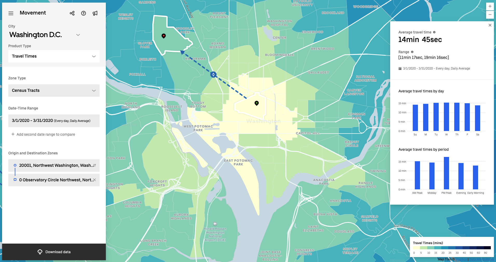
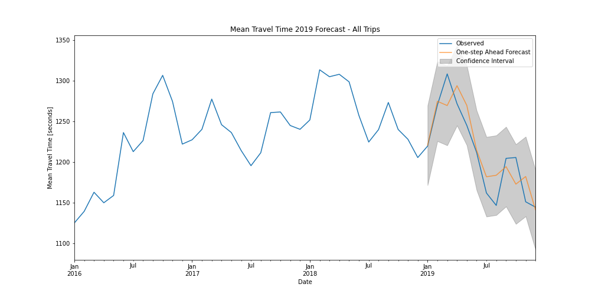
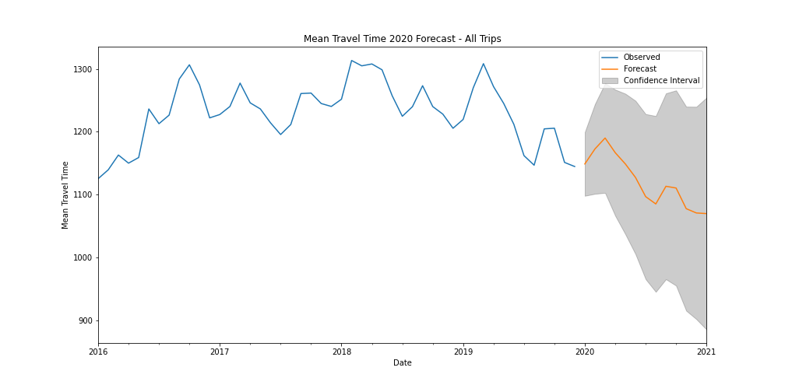

# Forecasting Uber Travel Times

#####    by <b>[Bobby Williams](https://github.com/bobbyiestofjos)</b>

---

## Repo Contents

- <b>data</b> - Various datasets used for modeling and reference.
- <b>images</b> - Various plots and images used in the documents found in this repo.
- <b>notebooks</b> - Jupyter Notebooks created for this project.
    - <b>[01_data_prep.ipynb](notebooks/01_data_prep.ipynb)</b> - Data prep...
    - <b>[02_eda.ipynb](notebooks/02_eda.ipynb)</b> - Jupyter Notebook containing Exploratory Data Analysis.
    - <b>[03_model_01_base.ipynb](notebooks/03_model_01_base.ipynb)</b> - Jupyter Notebook containing the process for creating a base model.
    - <b>[03_model_02_all.ipynb](notebooks/03_model_02_all.ipynb)</b> - Jupyter Notebook containing the process for creating all models.
- <b>[executive.ipynb](executive.ipynb)</b> - The main Jupyter Notebook containing the models and analysis for this project.
- <b>[presentation](presentation.pdf)</b> - The presentation for this project.
- <b>[README.md](README.md)</b> - A description of the project goals, process, and results.

---

## Uber Movement

In January of 2017 Uber introduced a website tool for urban planners to access and download their anonymized and aggregated trip data. Their intent was to help inform decisions about how to adapt existing infrastructure and invest in future solutions to make cities more efficient.

---

## Goal

Uber Movement allows site visitors to map trips between census tracts across select cities to view historical mean travel times between those tracts. Currently Uber Movement only provides historical information.

The goal of this project is to predict future travel times across Washington DC, via time series modeling, for urban planners utilizing Uber Movement, or a similar web app, for city planning.

---

## Data

Over 17 million data points across 32 csv files were pulled from the Uber Movement website. These were combined to form a single dataset which included a monthly average for Mean Travel Times from the year 2016 thru 2019 between census tract locations across Washington DC.

For this date range the granularity was limited to monthly averages broken down by weekday and weekend trips.

---

## Modeling

SARIMA modeling is a time series forecasting method that includes a component for data with underlying seasonality.

Due to the uniqueness of each trip across DC: trip distance, multiple route options, speed limits, etc, a separate model is needed for every trip. Over 31,000 optimized SARIMA models are available for deployment to forecast travel times.

There was a trade-off between model complexity and runtime due to processing power.

### Performance

This plot is for a weekday trip with the observed travel times along with the forecasted travel times from the model for 2019.

Multiple model iterations are produced for each trip using different parameters to minimize Root Mean Square Error, the metric used to determine model performance.

Here the Root Mean Square Error is a measure of the differences between values forecasted by the model and the observed values. (9.31)

### Predictions

After determining the optimum parameters for each model, forecasts are created for the year 2020.

These forecasts will allow urban planners to quickly look at what the next year or period of time will look like across specific areas of the city.

---

## Conclusion

Implement the process for model development from this project into the Uber Movement interface, or a similar web application, to allow urban planners to determine the potential impact of future city projects on forecasted travel times.

---

## Future Work

Road Construction  
To assist with this I’ve pulled occupancy permit data for Washington DC to determine the effects certain types of planned roadway construction/congestion such as Construction Staging Areas, Parades, and City Events have on travel times.

Wider Implementation  
The process in this project is easily scalable to additional cities for wider implementation.

Improve Modeling  
As mentioned, the models were simplified due to processing power constraints. Addressing this will allow for more complex models providing improved forecasting.