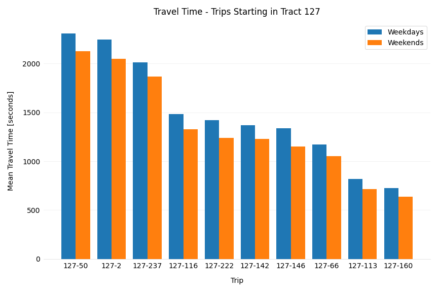
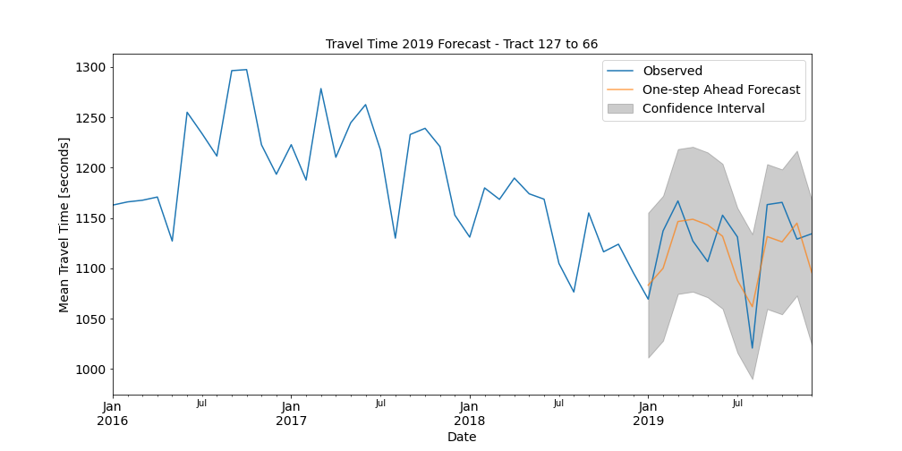
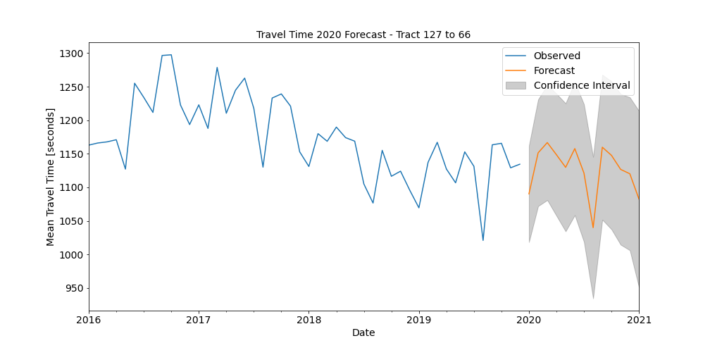

# Forecasting Uber Travel Times

#####    by <b>[Bobby Williams](https://github.com/bobbyiestofjos)</b>

---

## Repo Contents

- <b>data</b> - Various datasets used for modeling and reference. The raw datasets can be found on the Uber Movement website, [here](https://movement.uber.com/explore/washington_DC/travel-times/query?si=186&ti=&ag=censustracts&dt[tpb]=ALL_DAY&dt[dr][sd]=2020-03-01&dt[dr][ed]=2020-03-31&dt[wd;]=1,2,3,4,5,6,7&cd=&sa;=&sdn=&lang=en-US). They've also been included in the data/raw directory in this project.
- <b>images</b> - Various plots and images used in the documents found in this repo.
- <b>notebooks</b> - Jupyter Notebooks created for this project.
    - <b>[01_data_prep.ipynb](notebooks/01_data_prep.ipynb)</b> - Jupyter Notebook containing the process for preparing/cleaning the dataset.
    - <b>[02_eda.ipynb](notebooks/02_eda.ipynb)</b> - Jupyter Notebook containing Exploratory Data Analysis.
    - <b>[03_model.ipynb](notebooks/03_model.ipynb)</b> - Jupyter Notebook containing the process for creating the models.
- <b>[executive.ipynb](executive.ipynb)</b> - The main Jupyter Notebook containing the models and analysis for this project.
- <b>[presentation](presentation.pdf)</b> - The presentation for this project.
- <b>[README.md](README.md)</b> - A description of the project goals, process, and results.

---

## Uber Movement

In January of 2017 Uber introduced a website tool for urban planners to access their anonymized and aggregated trip data.

This is a screenshot of that tool, called Uber Movement. This site allows users to map trips between census tracts across select cities to view historical mean travel times between those tracts.

Their intent is to help inform decisions about how to adapt existing infrastructure to make cities more efficient.

---

## Goal

Currently Uber Movement only provides historical information.

The goal of this project is to predict future travel times across Washington DC, via time series modeling, for urban planners utilizing Uber Movement, or a similar web app, for city planning.

---

## Data

Over 17 million data points across 32 csv files were pulled from the Uber Movement website. These were combined to form a single dataset which included a monthly average for Mean Travel Times from the year 2016 thru 2019 between census tract locations across Washington DC.

For this date range the granularity was limited to monthly averages broken down by weekday and weekend trips.

Uber Movement aggregates data by trip. There are over 31,000 unique trips in the dataset. This is a plot of census tracts in the DC area, outlined in red, with an example of a trip that consists of a start location, tract 127 - the Lincoln Park/Capitol Hill area, at the tail of the green arrow and a destination, tract 66 - part of downtown, at the tip of the arrow head.

This chart shows the average trip time for 10 randomly selected trips starting in tract 127 by the time of week.

This plot shows the monthly mean trip times for the 127-66 trip by the time of week.

---

## Modeling

I utilized Seasonal AutoRegressive Integrated Moving Average (SARIMA) for modeling, this is a time series forecasting method that includes a component for data with underlying seasonality. Multiple model iterations were produced for each trip using different parameters to minimize Root Mean Square Error or RMSE, the metric used to determine model performance. Here the RMSE is a measure of the differences between travel times forecasted by the model and the observed travel times.

### Predicting

This plot shows the 2019 forecasted values generated by the model.

The blue line represents the observed or actual travel times, the orange line represents travel times predicted by the model, and the gray confidence interval area is a range that, with 95% certainty, the actual mean will fall within as predicted by the model.

The base model’s RMSE was 61.1 but after optimizing the model parameters, the Root Mean Square Error was reduced to 31.7. This means that on average the forecasted value was roughly 31 seconds from the actual value.

### Forecasting

This plot shows the 2020 forecasted values from the model using the optimized parameters. August of 2020 looks like the best month to schedule essential road construction projects to minimize impact on traffic for this trip set and tract areas.

The forecasted data points from this project will allow urban planners to quickly look at what the next year will look like across specific areas of the city and schedule urban projects accordingly.

---

## Conclusion

Implementation of the models from this project into the Uber Movement interface, or a similar web application, will allow urban planners to determine the potential impact of future city projects on forecasted travel times.

---

## Future Work

Road Construction  
- I’ve pulled occupancy permit data for Washington DC to determine the effects certain types of planned roadway construction/congestion such as Construction Staging Areas, Parades, and City Events have on travel times.

Wider Implementation  
- The process in this project is easily scalable to additional cities for wider implementation.

Improve Modeling  
- As mentioned, the models were simplified due to processing power constraints. Addressing this will allow for more complex models providing improved forecasting.

---

## Resources

Uber Movement (the data used in this project)
- [website](https://movement.uber.com/explore/washington_DC/travel-times/query?si=186&ti=&ag=censustracts&dt[tpb]=ALL_DAY&dt[dr][sd]=2020-03-01&dt[dr][ed]=2020-03-31&dt[wd;]=1,2,3,4,5,6,7&cd=&sa;=&sdn=&lang=en-US)

Machine Learning Mastery (the iterative process for selecting the SARIMA parameters with the lowest Root Mean Squared Error)
- [website](https://machinelearningmastery.com/how-to-grid-search-sarima-model-hyperparameters-for-time-series-forecasting-in-python/)